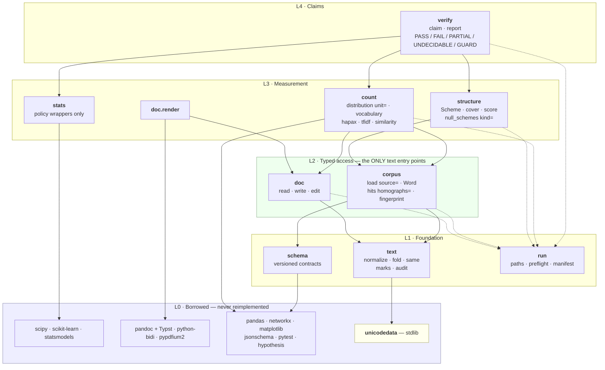
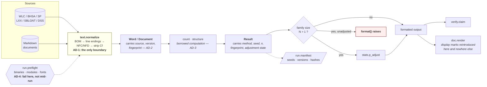
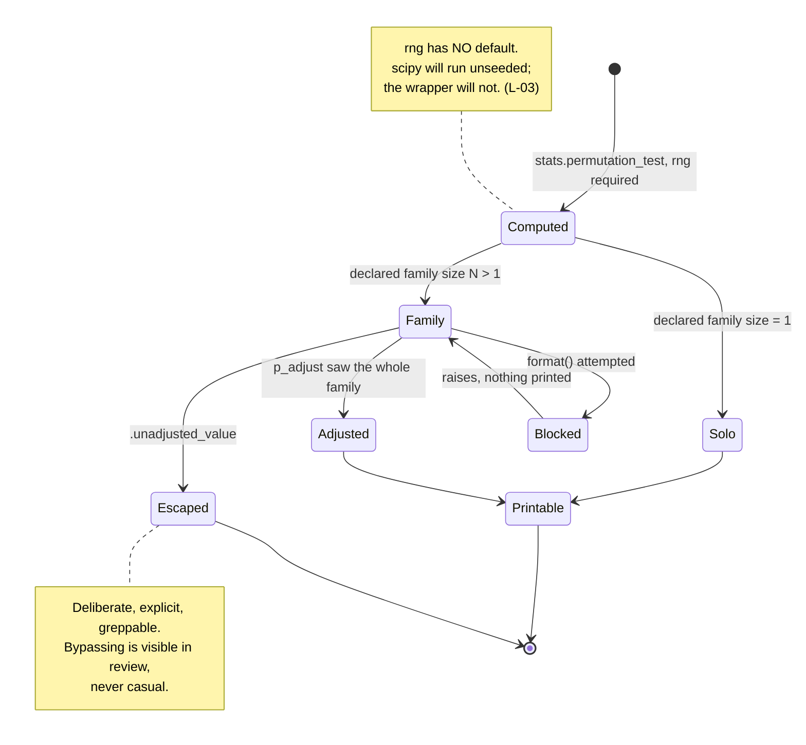
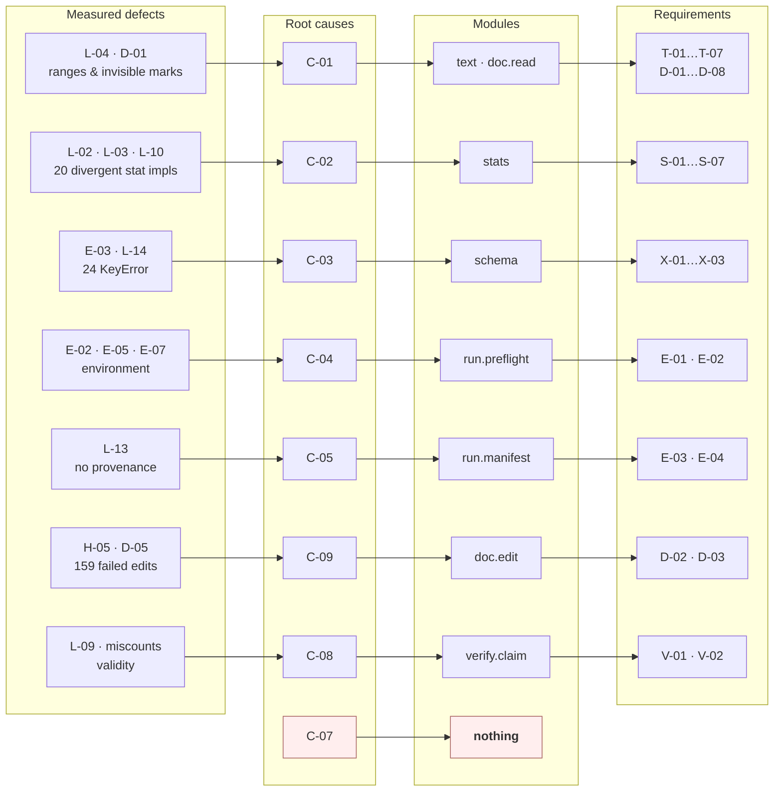

# Architecture diagrams

**Source:** step 4 of [`../input/task.md`](../input/task.md) — *"Create an
architecture diagram."*
**Companion to:** [`architecture.md`](architecture.md) (decisions AD-1…AD-7)
and [`requirements.md`](requirements.md).
**Date:** 2026-08-07.

Written as Mermaid rather than an exported image so the diagrams are
diffable, reviewable in a commit, and cannot drift silently from the prose —
the same reasoning the manual gives for keeping everything else in git.
They render in VS Code, GitHub, and pandoc with a Mermaid filter.

---

## 1. Layers

Dependencies point downward only; a cycle is a defect. `run` is dotted
because it is ambient — used by every layer, depending on none.

`unicodedata` is called out separately because it carries more of the design
than any installed dependency: `Mn` / `Cf` / `Pd` / `Po` replaces every
hand-maintained codepoint range, which is the direct fix for L-04 and D-01.

---

## 2. Data flow — AD-1 and AD-2

Two entry points, one normalization boundary, provenance travelling inside
the values.

Note the last edge: bidi display marks are reintroduced **only** at render.
Nothing upstream ever sees them — the strip-on-read decision, drawn.

---

## 3. The central mechanism

The one diagram worth reading closely. It is the structural answer to why 11
of 15 scripts skipped a multiple-comparison correction that was one import
away: **producing 20 uncorrected p-values and producing 1 looked identical
at the point of printing.**

---

## 4. Traceability — defect to requirement

Every module exists because something measurably went wrong. Nothing in the
design traces to a hypothetical.

**C-07 deliberately terminates in nothing.** 114 mid-stream truncations are
real and unaddressed: a library cannot detect that the script calling it was
written by an interrupted response. Drawing an arrow there would be the
false confidence this project exists to avoid.

C-08 reaches `verify.claim`, which **records** a human judgment about
validity — it does not supply one. C-06 appears nowhere: it is reduced only
as a side effect of there being less code to generate wrongly.

---

## 5. Reading order

1. §3 first — it is the design's actual argument.
2. §1 for structure, §2 for how text moves.
3. §4 last, as the audit: every box traces back to something measured.

Two boxes in §1 are riskier than they look. **`corpus`** is the only module
with no free equivalent and the largest to build — eight source formats
behind one `Word` shape, verified so far for WLC and three Text-Fabric
corpora only. **`stats`** is drawn as a thin wrapper on the assumption that
scipy's `permutation_type` can express the workspace's null models; that is
untested, and if it fails, `stats` grows real code and AD-3 weakens.
